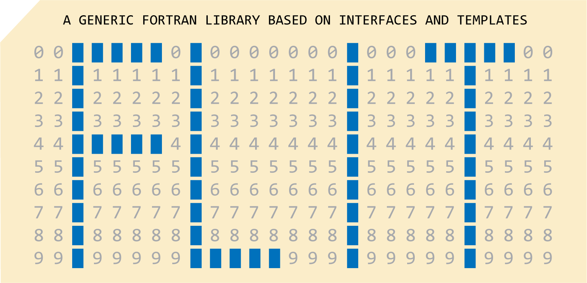

<p align="center">
  <br>
</p>

**FLIT: A Generic Fortran Library based on Interfaces and Templates**

`FLIT` is a generic Fortran library that provides functionality for
 - Single- and multi-dimensional array initialization, manipulation, and operations
 - Flexible parameter reading from text files or command-line arguments
 - Signal and image filtering and processing
 - Integral transforms and spectral analysis
 - Interpolation and function fitting
 - Statistics and random number generation
 - Linear algebra, sorting, clustering, and computational geometry
 - String manipulation, file I/O, and date/time utilities
 - User-friendly HDF5 I/O through a single-file HDF5 module, with unified interfaces for reading/writing scalars, multi-dimensional arrays, and attributes of various data types
 - MPI-based parallel communication and domain decomposition

`FLIT` offers consistent, user-friendly interfaces for the same functionality across different data types, demonstrating how modern Fortran can accelerate scientific application development. It may be useful for developing applications in computational physics, computational seismology, applied geophysics, signal and image processing, and related fields. 

This work is supported by Los Alamos National Laboratory's (LANL's) Laboratory Directed Research and Development (LDRD) projects. LANL is operated by Triad National Security, LLC, for the National Nuclear Security Administration (NNSA) of the U.S. Department of Energy (DOE) under Contract No. 89233218CNA000001. This research used high-performance computing resources provided by LANL's Institutional Computing program. 

This work is approved for public release by LANL's Feynman Center for Innovation (FCI) under record number #O4767.

# Requirements
 - Platform: Linux
 - Compiler: [Intel's oneAPI HPC Toolkit](https://www.intel.com/content/www/us/en/developer/tools/oneapi/hpc-toolkit-download.html), including ifx, mpiifx, icx, and icpx; other Fortran compilers (e.g., gfortran) are not supported at this time. 
 - (Optional) HDF5 

# Use
Use `test_install.sh` to install `FLIT` and its dependencies and to set the relevant environment variables. The compiled `FLIT` files will be placed in `lib`, including module/submodule files and a single static library file, `libflit.a`. 

To run examples:
```
cd test
bash test.sh
```

The [Makefile](test/Makefile) in the [test](test) directory can serve as an example of how to use `FLIT` in your code, including setting include paths and linking against the compiled library. 

Third-party code is included in [third_party](third_party). Please refer to [third_party/README](third_party/README.md) for details. 

# License
&copy; 2024-2026. Triad National Security, LLC. All rights reserved. 

This program is open source under the BSD 3-Clause License.

Redistribution and use in source and binary forms, with or without modification, are permitted provided that the following conditions are met:

- Redistributions of source code must retain the above copyright notice, this list of conditions and the following disclaimer.
 
- Redistributions in binary form must reproduce the above copyright notice, this list of conditions and the following disclaimer in the documentation and/or other materials provided with the distribution.
 
- Neither the name of the copyright holder nor the names of its contributors may be used to endorse or promote products derived from this software without specific prior written permission.

THIS SOFTWARE IS PROVIDED BY THE COPYRIGHT HOLDERS AND CONTRIBUTORS "AS IS" AND ANY EXPRESS OR IMPLIED WARRANTIES, INCLUDING, BUT NOT LIMITED TO, THE IMPLIED WARRANTIES OF MERCHANTABILITY AND FITNESS FOR A PARTICULAR PURPOSE ARE DISCLAIMED. IN NO EVENT SHALL THE COPYRIGHT HOLDER OR CONTRIBUTORS BE LIABLE FOR ANY DIRECT, INDIRECT, INCIDENTAL, SPECIAL, EXEMPLARY, OR CONSEQUENTIAL DAMAGES (INCLUDING, BUT NOT LIMITED TO, PROCUREMENT OF SUBSTITUTE GOODS OR SERVICES; LOSS OF USE, DATA, OR PROFITS; OR BUSINESS INTERRUPTION) HOWEVER CAUSED AND ON ANY THEORY OF LIABILITY, WHETHER IN CONTRACT, STRICT LIABILITY, OR TORT (INCLUDING NEGLIGENCE OR OTHERWISE) ARISING IN ANY WAY OUT OF THE USE OF THIS SOFTWARE, EVEN IF ADVISED OF THE POSSIBILITY OF SUCH DAMAGE.

# Documentation
Under development. Please refer to [LA-UR-24-26315](doc/doc_libflit.pdf) for details. 

# Author
Kai Gao, <kaigao@lanl.gov>

We welcome feedback and bug reports. 

If you use this package in your research and find it useful, please cite it as:
* Kai Gao, 2024, FLIT: A Generic Fortran Library based on Interfaces and Templates, URL: [github.com/lanl/flit](https://github.com/lanl/flit)
